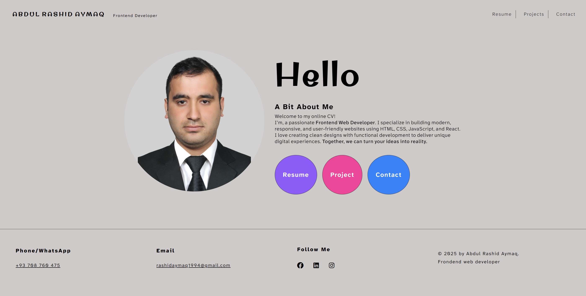

# My Portfolio & Resume Website

A modern, responsive portfolio website built with React and Vite to showcase my skills, projects, and professional experience. Features smooth animations, clean design, and an organized structure for optimal user experience.

## 🌟 Features

- **Responsive Design**: Fully responsive layout that works on all device sizes
- **Smooth Animations**: Custom scroll animations and transitions using React context
- **Multi-page Navigation**: Clean routing between Home, Resume, and Projects pages
- **Project Showcase**: Dedicated section to display my work with descriptions and live links
- **Professional Resume**: Interactive resume page with experience and skills
- **404 Handling**: Custom not found page for better user experience
- **Fast Development**: Built with Vite for lightning-fast development and builds

## 🛠️ Technologies Used

- **Frontend Framework**: React 18
- **Build Tool**: Vite
- **Routing**: React Router DOM
- **Styling**: SCSS with custom variables and mixins
- **Animations**: Custom ScrollAnimationProvider context
- **State Management**: React Context API for resume data
- **Icons**: Font Awesome

🤝 Contributing
This is a personal portfolio project, but suggestions and improvements are welcome. Please feel free to fork the repository and submit pull requests.

📞 Contact
Feel free to reach out for questions or collaboration opportunities!

Email: [rashidaymaq1994@gmail.com]

LinkedIn: [https://www.linkedin.com/in/abdul-rashid-aymaq-3854a435a?utm_source=share&utm_campaign=share_via&utm_content=profile&utm_medium=android_app]

Portfolio: [https://aymaq-code.github.io/my-resume/]

